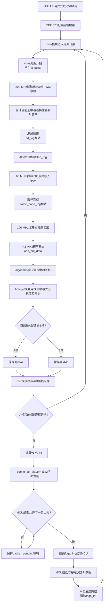
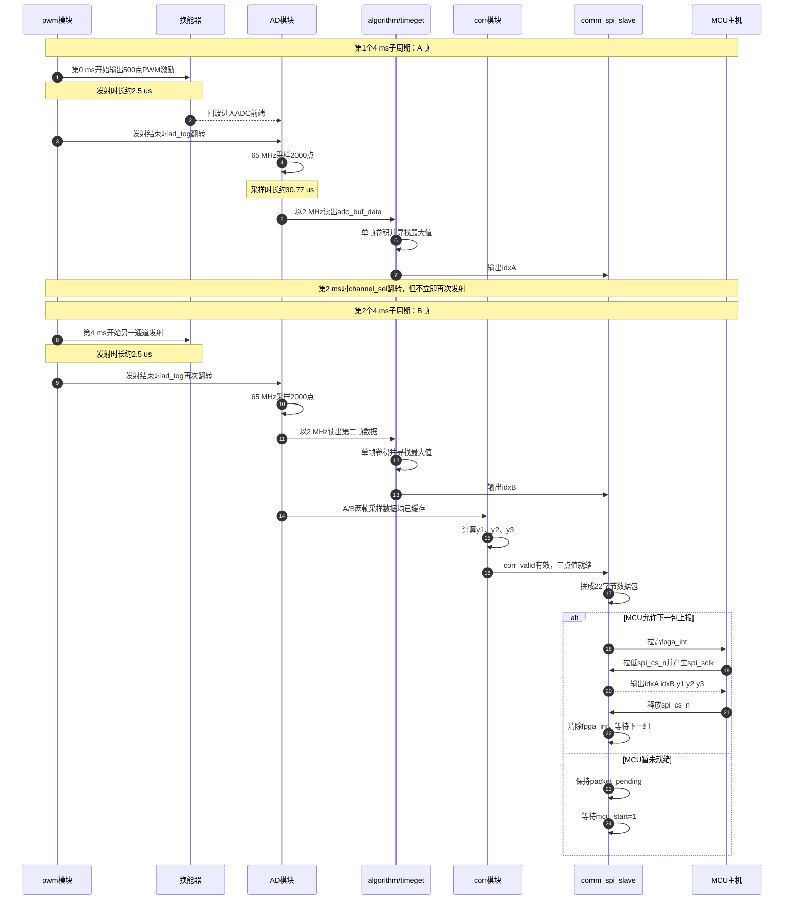
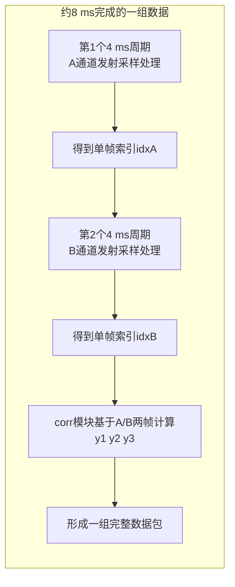
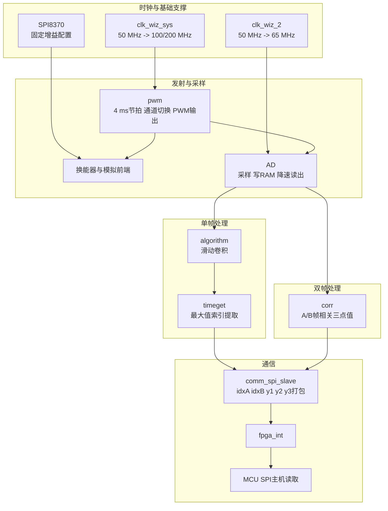

# FPGA整体工作流程与单周期时序分析

## 1. 文档说明

这份文档不是单独介绍某一个模块，而是站在当前工程整体角度，梳理 `FPGA_prj_code/RUF_MIX.srcs/sources_1/new` 中各个模块在一次完整测量循环里是如何协同工作的。重点回答下面两个问题：

1. 一个完整循环中，FPGA 在什么时刻做什么事情。
2. 代码里的 `4 ms`、`8 ms`、`发射`、`采样`、`卷积`、`上报` 之间到底是什么关系。

本文档以当前集成度更高的 [`RUF.v`](../FPGA_prj_code/RUF_MIX.srcs/sources_1/new/RUF.v) 为主线进行分析。  
[`Top.v`](../FPGA_prj_code/RUF_MIX.srcs/sources_1/new/Top.v) 更像是较早的调试/过渡版本，保留了旧的 `communication.v` 与 `DeltaT.v` 接法，但当前工程更完整的工作链路已经体现在 `RUF.v` 中。

---

## 2. 当前工程的主链路

从 `RUF.v` 的实例化关系来看，当前项目的主工作链路可以概括为：

`PWM发射控制 -> 换能器发射 -> AD采样 -> 数据降速读出 -> algorithm卷积 -> timeget取峰值索引 -> corr计算y1/y2/y3 -> comm_spi_slave打包并等待MCU读取`

对应模块如下：

- [`pwm.v`](../FPGA_prj_code/RUF_MIX.srcs/sources_1/new/pwm.v)：产生周期节拍、选择通道、输出发射波形，并在发射结束时给出 `ad_tog` 事件。
- [`AD.v`](../FPGA_prj_code/RUF_MIX.srcs/sources_1/new/AD.v)：接收 `ad_tog` 后开始采样，写满一帧后再降速读出给算法模块。
- [`algorithm.v`](../FPGA_prj_code/RUF_MIX.srcs/sources_1/new/algorithm.v)：对单帧采样数据和参考模板做滑动卷积，输出一串卷积结果。
- [`timeget.v`](../FPGA_prj_code/RUF_MIX.srcs/sources_1/new/timeget.v)：在单帧卷积结果中寻找最大值和对应索引 `max_idx`。
- [`corr.v`](../FPGA_prj_code/RUF_MIX.srcs/sources_1/new/corr.v)：分别缓存 A/B 两帧采样数据，在两帧都到齐后计算 `y1/y2/y3`。
- [`comm_spi_slave.v`](../FPGA_prj_code/RUF_MIX.srcs/sources_1/new/comm_spi_slave.v)：把 `idxA / idxB / y1 / y2 / y3` 打成 22 字节包，通过 SPI 从机接口提供给 MCU。
- [`SPI8370.v`](../FPGA_prj_code/RUF_MIX.srcs/sources_1/new/SPI8370.v)：给前端增益器件写固定增益值，属于外围配置逻辑。

---

## 3. 先说结论：4 ms 和 8 ms 的真实含义

当前代码里，**一次发射-采样-单帧处理** 的节拍是 `4 ms`，而 **A/B 两个方向都完成并形成一组可上传数据包** 的节拍是 `8 ms`。

更具体地说：

- `pwm.v` 在 `100 MHz` 时钟域下使用 `cnt_4ms` 从 `0` 计数到 `399999`，因此一个完整计数周期是 `4 ms`。
- 每个 `4 ms` 周期的开始时刻，只触发 **一次** 发射脉冲 `tx_pulse_100m`。
- `channel_sel` 在 `2 ms` 时刻翻转，但这个翻转不是再次发射，而是为了让**下一个 4 ms 周期开始时**改用另一通道发射。
- 因而：
  - 第一个 `4 ms` 周期完成一帧 A 通道测量；
  - 第二个 `4 ms` 周期完成一帧 B 通道测量；
  - 两帧合在一起，约 `8 ms`，才构成一组完整的 `idxA / idxB / y1 / y2 / y3`。

这也就和你已有算法文档里“每 `4 ms` 一次获取、两次共 `8 ms` 组成一组”的说法对上了。

---

## 4. 一个完整 8 ms 测量循环的详细过程

下面按“先 A 后 B”的方式，展开一次完整循环。

### 4.1 第 0 ms：开始第一帧发射

在 `pwm.v` 中，`cnt_4ms == 0` 时产生 `tx_pulse_100m`。这个脉冲从 `100 MHz` 域同步到 `200 MHz` 域后，形成 `tx_start_200m`，随后：

- `pwm_en` 被拉高；
- `addra` 从 `0` 开始递增；
- 两个 PWM ROM `blk_mem_gen_0` / `blk_mem_gen_1` 被依次读取；
- 若此时 `channel_sel = 1`，则波形输出到 `pwm_p / pwm_n`；
- 若 `channel_sel = 0`，则波形输出到 `pwm2_p / pwm2_n`。

由于 `addra` 从 `0` 到 `499`，共输出 `500` 个点；发射时钟是 `200 MHz`，因此本次发射持续时间约为：

`500 / 200 MHz = 2.5 us`

也就是说，在一个 `4 ms` 周期里，真正的激励发射只占最前面的约 `2.5 us`。

### 4.2 第约 2.5 us：发射结束，触发采样

在 `pwm.v` 中，当 `pwm_en && addra == 499` 时，`ad_tog_reg` 翻转一次。  
这个 `ad_tog` 不是电平保持，而是“事件型翻转标志”，供 `AD.v` 跨时钟域检测。

因此当前工程的真实关系是：

- 不是“外部模块单独发 `ad_start` 给 AD”；
- 而是 **FPGA 先控制发射，再在发射尾部自己产生 `ad_tog`，通知 AD 模块启动采样**。

### 4.3 第约 2.5 us 后：AD 模块开始采样

在 `AD.v` 中：

- `ad_tog` 被同步到 `adc_clk = 65 MHz` 域；
- 翻转检测后得到 1 拍宽的 `ad_start_pulse`；
- `ad_en` 被置高；
- 写地址 `addra` 从 `0` 开始；
- ADC 输入的 `12 bit` 偏移二进制数据先被转成补码，再扩展到 `16 bit`；
- 随后写入双口 RAM。

采样长度由参数 `AD_LEN = 2000` 决定，因此采样持续时间约为：

`2000 / 65 MHz ≈ 30.77 us`

也就是说，从发射结束到本帧采样完成，量级只有几十微秒。

### 4.4 采样写满后：开始降速读出

采样写满后，`AD.v` 在 `adc_clk` 域翻转 `frame_done_tog`，再同步到 `al_clk = 100 MHz` 域，得到 `start_read` 脉冲。

从这一刻开始：

- `trans_flag` 拉高；
- `clk_cnt` 在 `100 MHz` 域内计数；
- 每当 `clk_cnt == CNT-1` 时产生一次 `enb`；
- 这里 `CNT = 50`，因此读出速率为：

`100 MHz / 50 = 2 MHz`

于是 2000 点读完大约需要：

`2000 / 2 MHz = 1 ms`

这就是为什么你在系统层面看到“采样很快完成，但算法输入流是较慢节拍持续送入”的现象。  
当前代码并不是采完后瞬间全部送进算法，而是通过 RAM 以 `2 MHz` 流方式送给后级。

### 4.5 读出的同时：algorithm 模块实时卷积

`algorithm.v` 接收 `adc_buf_data` 和 `adc_buf_en` 后，做的是单帧滑动卷积。

这部分可以理解成：

1. 先把输入样本推入长度为 `TAPS = 150` 的滑动窗口；
2. 当窗口填满后，每来一个新样本，就对当前窗口和参考模板做一次卷积；
3. 这一帧总采样点数是 `2000`，因此单帧卷积输出点数为：

`NUM = DATA_LEN - TAPS + 1 = 2000 - 150 + 1 = 1851`

4. 每次卷积内部并不是一次时钟全算完，而是利用 `P = 5` 路并行乘法器分 `ROUNDS = 30` 拍完成。

因为算法时钟是 `100 MHz`，所以一次卷积计算大约耗时：

`30 / 100 MHz = 0.3 us`

而输入样本到达节拍是 `2 MHz`，即每个样本间隔 `0.5 us`。  
因此当前参数下，`algorithm.v` 是来得及在下一点到来前完成上一次卷积的。

### 4.6 单帧卷积结束：timeget 给出本帧峰值索引

`timeget.v` 的工作方式比较直接：

- 只要 `out_valid` 为高，就拿当前卷积值和历史最大值比较；
- 如果更大，就更新 `curr_max` 和对应 `curr_idx`；
- 当 `frame_end` 到来时，输出本帧的：
  - `max_out`
  - `max_idx`
  - `max_valid`

这意味着：

- 在第一个 `4 ms` 周期内，会产生第一帧的 `max_idx`；
- 在第二个 `4 ms` 周期内，会产生第二帧的 `max_idx`。

`comm_spi_slave.v` 正是利用这一点，通过 `channel_sel` 来区分：

- `channel_sel = 1` 时，把 `max_idx` 记为 `idxA`
- `channel_sel = 0` 时，把 `max_idx` 记为 `idxB`

由于单帧算法在大约 `1 ms` 量级内就能完成，而 `channel_sel` 要到 `2 ms` 才翻转，因此此处用 `channel_sel` 区分当前帧方向是成立的。

### 4.7 第 2 ms：通道翻转，但不立刻发射

这是当前代码里最容易误解的一点。

`pwm.v` 在 `cnt_4ms == 200000` 时翻转 `channel_sel_100m`，对应 `2 ms` 时刻。  
但这个时刻并没有第二次 `tx_pulse`，因此：

- 这里不是“第二次发射开始”；
- 而只是“把下一个 4 ms 周期要用的通道预先切换好”。

所以单个 `4 ms` 周期内部只有一次发射。

### 4.8 第 4 ms：第二帧开始

当 `cnt_4ms` 重新回到 `0` 时，又会产生一次 `tx_pulse_100m`。  
由于前面在 `2 ms` 时已经翻转过 `channel_sel`，这一次发射就会走另一通道。

之后又重复一遍：

- 发射约 `2.5 us`
- 触发 AD 采样
- 采样约 `30.77 us`
- 降速读出约 `1 ms`
- 卷积 + 峰值提取

到此，A/B 两帧的单帧结果都齐了。

### 4.9 A/B 两帧都齐后：corr 模块计算 y1 / y2 / y3

`corr.v` 与 `algorithm.v` 的角色不同，它不是处理单帧内部的滑动卷积，而是：

- 先把 `channel_seg = 1` 时的 2000 点写入 `RAM_A`
- 再把 `channel_seg = 0` 时的 2000 点写入 `RAM_B`
- 等待 `fullA && fullB` 同时成立后，才进入相关计算状态

随后依次计算：

- `y1 = A[1..1999] * B[0..1998]`
- `y2 = A[0..1999] * B[0..1999]`
- `y3 = A[0..1998] * B[1..1999]`

三段总乘加次数为：

`1999 + 2000 + 1999 = 5998`

该模块在 `100 MHz` 下每拍发起一次 RAM 读请求，乘法器再经过约 `3` 拍流水延迟后回加，因此整个 `y1 / y2 / y3` 计算量级约为几十微秒，粗略可按 `60 us` 左右理解。

计算完后，`corr.v` 会打一拍 `out_valid_reg`，这正是后续打包上传的触发条件。

### 4.10 形成数据包并通知 MCU

在 `comm_spi_slave.v` 中，只有满足下面三个条件，才会形成一个完整待发包：

1. 已经拿到 `idxA`
2. 已经拿到 `idxB`
3. `corr_valid` 到来，说明 `y1 / y2 / y3` 也准备好了

然后模块会把数据拼成 22 字节：

- 2 字节 `idxA`
- 2 字节 `idxB`
- 6 字节 `y1`
- 6 字节 `y2`
- 6 字节 `y3`

总共：

`2 + 2 + 6 + 6 + 6 = 22 字节 = 176 bit`

但它不会立刻强行发 SPI，而是先进入 `packet_pending` 状态，等待 MCU 给出 `mcu_start = 1`，表示“我准备好接收下一包了”。

条件满足后：

- `packet_ready` 置位；
- `fpga_int` 拉高，通知 MCU 来读；
- MCU 拉低 `spi_cs_n` 后开始时钟读取；
- FPGA 在 `spi_sclk` 下降沿移动下一位，在主机的上升沿被采样；
- 当 `spi_cs_n` 回到高电平时，本包完成，`fpga_int` 清零。

于是，一组完整的 A/B 测量结果就完成了一次上报。

---

## 5. 用表格看一个完整循环

下表给出当前工程中“一个完整 A+B 组”的推荐理解方式。

| 时间位置 | 主要事件 | 说明 |
| --- | --- | --- |
| `0 us` | 第一帧发射开始 | 当前通道由 `channel_sel` 决定 |
| `0 ~ 2.5 us` | PWM 波形输出 | `500` 点，`200 MHz` |
| `约 2.5 us` | `ad_tog` 翻转 | 发射尾部触发采样 |
| `约 2.5 ~ 33 us` | ADC 采样 | `2000` 点，`65 MHz` |
| `约 33 us ~ 1.03 ms` | RAM 降速读出 + 单帧卷积 | `2 MHz` 输入流，卷积并行进行 |
| `约 1.03 ms` | `timeget` 输出本帧 `max_idx` | 记为 `idxA` 或 `idxB` |
| `2 ms` | `channel_sel` 翻转 | 只切换下一帧通道，不立即发射 |
| `4 ms` | 第二帧发射开始 | 进入另一通道 |
| `4 ms ~ 5.03 ms` | 第二帧采样、读出、卷积 | 同第一帧 |
| `约 5.03 ms` | 第二帧 `max_idx` 输出 | 与第一帧凑成一组索引 |
| `约 5.03 ms + 60 us` | `corr` 输出 `y1/y2/y3` | 相关三点值准备完成 |
| 随后 | SPI 数据包就绪 | 等待 MCU 允许并拉高 `fpga_int` |
| 读完后 | 一组结果上报完成 | 继续等待下一组 `8 ms` 循环 |

从系统节拍上看，可以把整个链路理解为：

- `4 ms` 产生一个方向的峰值索引；
- `8 ms` 形成一组完整可上传数据；
- 包上传耗时取决于 MCU 侧 SPI 读数时钟，而不是 FPGA 固定内部节拍。

---

## 6. 模块之间的关键触发关系

为了方便后续写论文或画流程图，可以把触发关系简化成下面这几条：

### 6.1 发射到采样

- `tx_pulse_100m -> tx_start_200m`
- `tx_start_200m -> pwm_en = 1`
- `pwm_en && addra == 499 -> ad_tog 翻转`
- `ad_tog -> AD模块启动采样`

### 6.2 采样到单帧卷积

- `AD写满一帧 -> frame_done_tog 翻转`
- `frame_done_tog -> start_read`
- `start_read -> adc_buf_en 周期性输出`
- `adc_buf_en -> algorithm 开始按流处理`

### 6.3 单帧卷积到峰值索引

- `algorithm` 对每个有效窗口给出一项卷积结果
- `timeget` 在整帧内部持续跟踪最大值
- `frame_end` 到来后输出 `max_idx` 和 `max_valid`

### 6.4 两帧到三点相关值

- `corr.v` 先缓存 A 帧，再缓存 B 帧
- `fullA && fullB` 后开始 `y1 / y2 / y3`
- 结束时输出 `corr_valid`

### 6.5 打包到 MCU

- `idxA + idxB + y1 + y2 + y3` 齐全后形成 `packet_pending`
- `mcu_start = 1` 时允许上报
- `fpga_int = 1` 通知 MCU 读取
- `spi_cs_n` 上升沿视为一包读取结束

---

## 7. 当前工程里几个容易混淆的点

### 7.1 `start` 不是“每次发射启动信号”

虽然顶层端口名叫 `start`，但在当前 `RUF.v` 里：

- `pwm.v` 的 `start` 端口被直接接成了 `1'b0`
- 发射节拍来自 `pwm.v` 内部计数器，而不是外部 `start`
- 顶层输入 `start` 实际被送进了 `comm_spi_slave.v` 的 `mcu_start`

也就是说，**当前代码中的测量过程是 FPGA 自主按周期跑的，外部 `start` 主要用于 MCU 通信握手，而不是用于启动发射。**

### 7.2 `channel_sel` 在 2 ms 翻转，但不是 2 ms 发一次

这个已经在前文强调过一次。  
当前代码是：

- `4 ms` 触发一次发射
- `2 ms` 只切换通道准备下一帧

所以不要把 `channel_sel` 翻转时刻误读成第二次发射时刻。

### 7.3 当前工程里存在两套“上传逻辑”

在 `sources_1/new` 目录里同时存在：

- `communication.v`
- `comm_spi_slave.v`

其中：

- `communication.v` 是早期的 FPGA 做 SPI 主机、主动发送 16 位数据的版本；
- `comm_spi_slave.v` 才是当前 `RUF.v` 中真正使用的版本，由 MCU 做主机，FPGA 做从机，上传 22 字节完整数据包。

因此如果后面要写整机工作流程，应优先以 `RUF.v + comm_spi_slave.v` 为准。

### 7.4 `Top.v` 和 `RUF.v` 不是同一代集成方式

`Top.v` 中仍然能看到：

- `DeltaT.v`
- `communication.v`

而 `RUF.v` 中已经切换成：

- `corr.v`
- `comm_spi_slave.v`

因此如果你后面要写论文中的“当前实现”，建议以 `RUF.v` 作为主版本；`Top.v` 可以理解为调试/过渡版本。

### 7.5 `SPI8370.v` 当前是持续写固定增益

在 `RUF.v` 中，`SPI8370` 的输入被固定为：

- `wr_en = 1'b1`
- `wr_dat = 8'd99`

这意味着当前代码行为更接近“持续重复写固定增益值 99”，而不是“上电只写一次后保持”。  
这部分不直接参与时差测量主流程，但属于当前工程实现上的一个外围特征。

### 7.6 测试平台里 `start=0` 与现行握手逻辑并不完全一致

`ai_RUF_tb.v` 里把 `start` 固定成了 `0`，但 `comm_spi_slave.v` 的上报条件是 `mcu_start = 1` 时才允许 `fpga_int` 拉高。  
这两者之间存在明显不一致，更像是测试平台还保留了旧版本假设。

如果后续要严格按现行 `RUF.v` 通信链验证，应重点核查这一点。

---

## 8. 适合直接拿去画图的流程总结

如果后续要在论文里画“FPGA内部工作流程图”，建议直接用下面这条主链：

`4ms节拍开始 -> FPGA输出PWM激励 -> 换能器发射 -> 发射尾部产生ad_tog -> AD采样2000点 -> RAM缓存 -> 2MHz读出 -> algorithm做单帧卷积 -> timeget输出该帧峰值索引 -> 下一4ms切换通道重复一次 -> corr基于A/B两帧计算y1/y2/y3 -> comm_spi_slave打包22字节 -> fpga_int通知MCU读取`

如果要再压缩成一句话，可以写成：

**当前工程采用“FPGA周期性自主发射 + 单帧峰值提取 + 双帧相关补充 + MCU主机读取结果”的工作方式，其中每 `4 ms` 完成一帧测量，每 `8 ms` 形成一组完整上传数据。**

---

## 9. Mermaid流程图

下面给出几种适合当前工程的 Mermaid 图。  
如果后续要直接放进支持 Mermaid 的 Markdown 环境中，可以直接使用；如果要放进论文，也可以先用这些图作为草稿，再据此重新绘制正式图片。

### 9.1 整体工作流程图

### 9.2 一个完整 8 ms 循环的模块时序图

### 9.3 4 ms 与 8 ms 关系图

### 9.4 FPGA内部模块分工图

### 9.5 后续如果要画论文正式图，建议这样处理

- `9.1` 适合作为“系统总体流程图”的草稿。
- `9.2` 适合作为“一个完整测量循环的时序图”草稿。
- `9.3` 适合单独解释“4 ms 单帧、8 ms 一组”的概念。
- `9.4` 适合第三章“系统总体架构”中说明模块分工。

如果后面你想，我还可以继续帮你补两种图：

- 更偏论文风格的“简化版 Mermaid 图”
- 更偏源码分析风格的“信号级状态/时序图”
