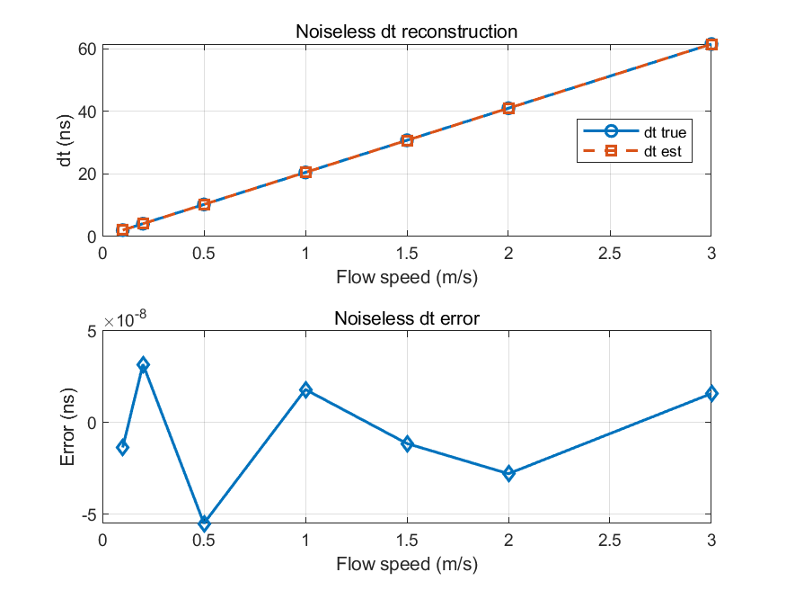
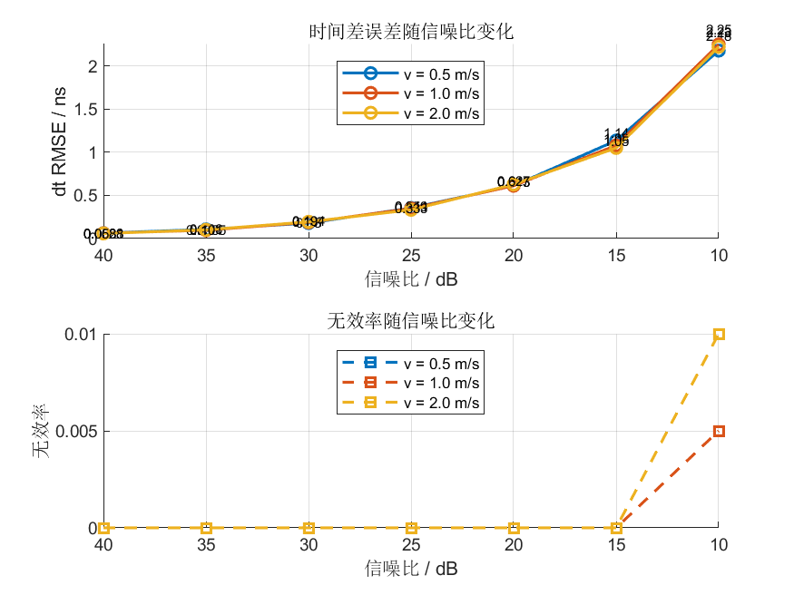
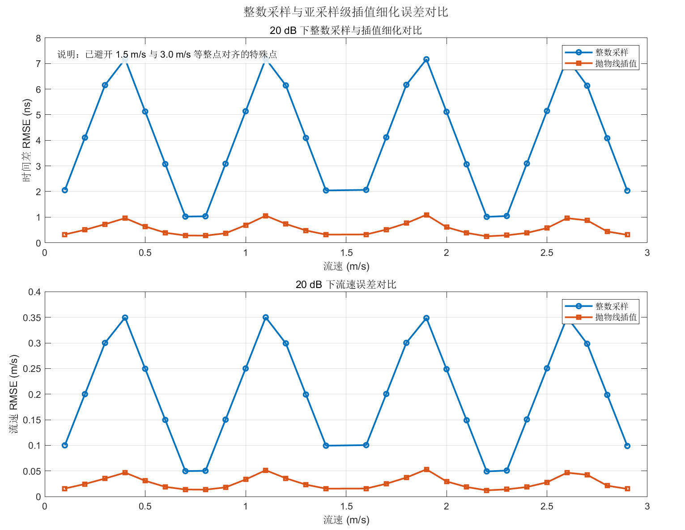
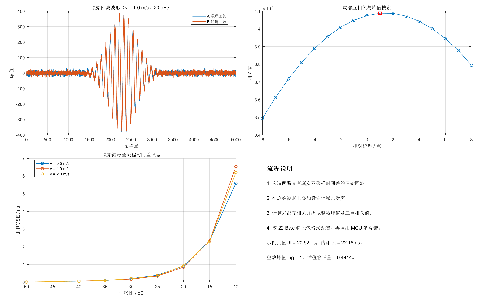

# 6.3 时差提取正确性验证

时间差提取正确性验证的重点在于确认两类问题：一是无噪声条件下 `Δt` 解算链是否数值正确；二是引入噪声和采样量化后，时间差误差会按照何种规律增长。相应实验分别从无噪声验证、噪声鲁棒性验证、插值必要性验证以及原始波形级补充验证四个方面展开。

## 6.3.1 无噪声条件下的时间差解算

无噪声实验直接由目标流速反推理论时间差，再构造对应特征包并送入后级解算函数。该实验等价于在理想输入条件下，对“数据包解析 - 三点插值 - `Δt` 重建”这一链条进行单独检验。

图6-2给出了无噪声条件下的时间差估计结果。估计值与理论值在图中近乎重合，残差曲线维持在极低量级，说明数值链路不存在系统性偏移。

图6-2 无噪声条件下的时间差估计结果  

表6-2给出了无噪声实验的汇总指标。总样本数与有效样本数完全一致，失效率与离群率均为零，`RMSE` 约为 `2.86×10^-8 ns`，已接近数值计算精度极限。据此可认为当前 `Δt` 解算过程在理想条件下具有正确的数值实现。

表6-2 无噪声条件下的时间差解算指标

| 指标 | 数值 |
| --- | ---: |
| 总样本数 | 7 |
| 有效样本数 | 7 |
| 失效率 | 0 |
| 偏差 | `-6.03×10^-9 ns` |
| 标准差 | `3.02×10^-8 ns` |
| `RMSE` | `2.86×10^-8 ns` |
| `95%` 区间 | `[-5.10×10^-8, 2.98×10^-8] ns` |
| 离群率 | 0 |

## 6.3.2 不同信噪比下的时间差误差

在噪声鲁棒性实验中，局部相关三点样本上叠加满足目标信噪比的随机噪声，然后重复进行数据包解码和 `Δt` 计算。图6-3表明，随着信噪比降低，时间差误差呈明显上升趋势。高信噪比区域的误差处于亚纳秒量级，而低信噪比区域误差快速增大。

图6-3 不同信噪比下的时间差误差曲线  

以 `v = 1.0 m/s` 为例，代表性结果列于表6-3。`SNR` 从 `40 dB` 降至 `10 dB` 时，`Δt` 的 `RMSE` 由 `0.0623 ns` 增加到 `2.2525 ns`，说明噪声扰动会显著增大时间差估计波动；`10 dB` 条件下还出现 `0.5%` 的失效率，表明该工况已接近较差输入条件。

表6-3 `v = 1.0 m/s` 时不同信噪比下的时间差误差

| SNR / dB | 偏差 / ns | 标准差 / ns | `RMSE / ns` | `95%` 区间 / ns | 失效率 |
| ---: | ---: | ---: | ---: | ---: | ---: |
| 40 | 0.0076 | 0.0620 | 0.0623 | `[-0.1113, 0.1302]` | 0 |
| 30 | 0.0024 | 0.1879 | 0.1875 | `[-0.3614, 0.3275]` | 0 |
| 20 | -0.0031 | 0.6143 | 0.6127 | `[-1.0244, 1.2442]` | 0 |
| 15 | 0.0537 | 1.0825 | 1.0811 | `[-1.8084, 2.4045]` | 0 |
| 10 | 0.3960 | 2.2230 | 2.2525 | `[-2.7808, 5.6871]` | 0.005 |

由图6-3和表6-3可知，`20 dB` 以上时系统仍保持较好的时间差解算能力；当 `SNR` 降至 `10 dB` 附近时，误差和失效率均开始上升，表明该条件已接近较差工况。

## 6.3.3 整数采样定位与抛物线插值对比

三点抛物线插值的必要性通过整数采样定位与插值定位对比实验加以说明。图6-4显示，整数采样定位的误差随流速变化呈现周期性起伏，而抛物线插值后的误差整体保持在更低水平。

图6-4 整数采样定位与抛物线插值对比  

这类起伏来源于典型的采样量化效应。真实峰值位置随流速连续变化，而整数采样法只能将其量化到最近的离散采样点。当真实峰值靠近某一采样点时，量化误差较小；当峰值接近两个采样点中间位置时，量化误差增大，因此曲线上会出现近似周期性的波动。为避免个别整数对齐点对整体趋势判断产生干扰，当前扫描中已避开 `1.5 m/s` 与 `3.0 m/s` 等特殊点。

表6-4给出了若干代表性流速点的对比结果。以 `v = 1.0 m/s` 为例，整数采样下 `Δt RMSE` 为 `5.1355 ns`，对应流速 `RMSE` 为 `0.2502 m/s`；采用抛物线插值后，`Δt RMSE` 降至 `0.6854 ns`，流速 `RMSE` 降至 `0.0334 m/s`。这说明插值细化能够显著削弱整数采样量化误差。

表6-4 典型流速点下的插值对比结果

| 流速 / m/s | 方法 | 偏差 / ns | 标准差 / ns | `Δt RMSE / ns` | 流速 `RMSE / m/s` |
| ---: | --- | ---: | ---: | ---: | ---: |
| 0.4 | 整数采样 | 7.1766 | 0 | 7.1766 | 0.3496 |
| 0.4 | 抛物线插值 | -0.1199 | 0.9543 | 0.9594 | 0.0468 |
| 1.0 | 整数采样 | -5.1355 | 0 | 5.1355 | 0.2502 |
| 1.0 | 抛物线插值 | 0.1373 | 0.6732 | 0.6854 | 0.0334 |
| 2.0 | 整数采样 | 5.1136 | 0 | 5.1136 | 0.2489 |
| 2.0 | 抛物线插值 | -0.0696 | 0.6042 | 0.6067 | 0.0296 |

由此可见，三点插值不仅能够降低平均误差水平，还能够显著抑制由采样量化造成的误差起伏，因此是实现亚采样级时间差估计的关键步骤。

## 6.3.4 原始波形级补充验证

为验证前端特征提取与后端数值解算之间的一致性，进一步从两路原始回波出发构建全流程实验。实验流程包括：生成含已知时间差的两路波形、叠加噪声、执行局部互相关与峰值搜索、提取三点相关值、封装 `22 Byte` 特征包、完成后级 `Δt` 解算。

图6-5给出了原始波形级全流程验证结果。图中同时展示了含噪双通道回波、局部相关曲线与主峰位置，以及在不同信噪比下全流程时间差误差的变化趋势。

图6-5 原始波形级全流程验证结果  

表6-5给出了 `v = 1.0 m/s` 时的代表性结果。无噪声条件下，全流程 `Δt RMSE` 约为 `7.90×10^-4 ns`；在 `40 dB`、`20 dB` 和 `10 dB` 时，`Δt RMSE` 分别约为 `0.0559 ns`、`0.8455 ns` 和 `6.5315 ns`。其中 `10 dB` 条件下出现 `2.5%` 的离群率，说明从原始波形出发时低信噪比对相关峰定位的影响更为突出。

表6-5 原始波形级全流程时间差验证结果（`v = 1.0 m/s`）

| SNR / dB | 偏差 / ns | 标准差 / ns | `Δt RMSE / ns` | `95%` 区间 / ns | 流速 `RMSE / m/s` |
| ---: | ---: | ---: | ---: | ---: | ---: |
| 无噪声 | -0.00079 | 0 | 0.00079 | `[-0.00079, -0.00079]` | 0.00050 |
| 40 | -0.00524 | 0.05586 | 0.05587 | `[-0.1076, 0.0927]` | 0.00280 |
| 20 | 0.15337 | 0.83499 | 0.84553 | `[-1.5162, 1.6173]` | 0.04110 |
| 10 | 0.40650 | 6.54619 | 6.53152 | `[-13.8710, 11.5941]` | 0.31781 |

原始波形级结果与特征级结果在变化趋势上保持一致，说明当前 MATLAB 平台中的前端特征提取模型与后端解算模型之间保持了较好的接口一致性。
