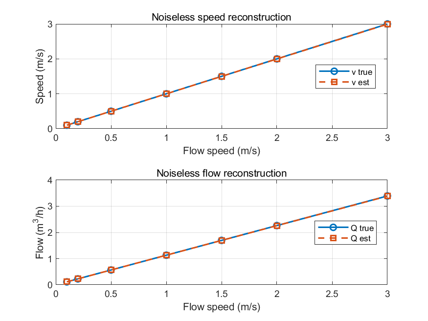
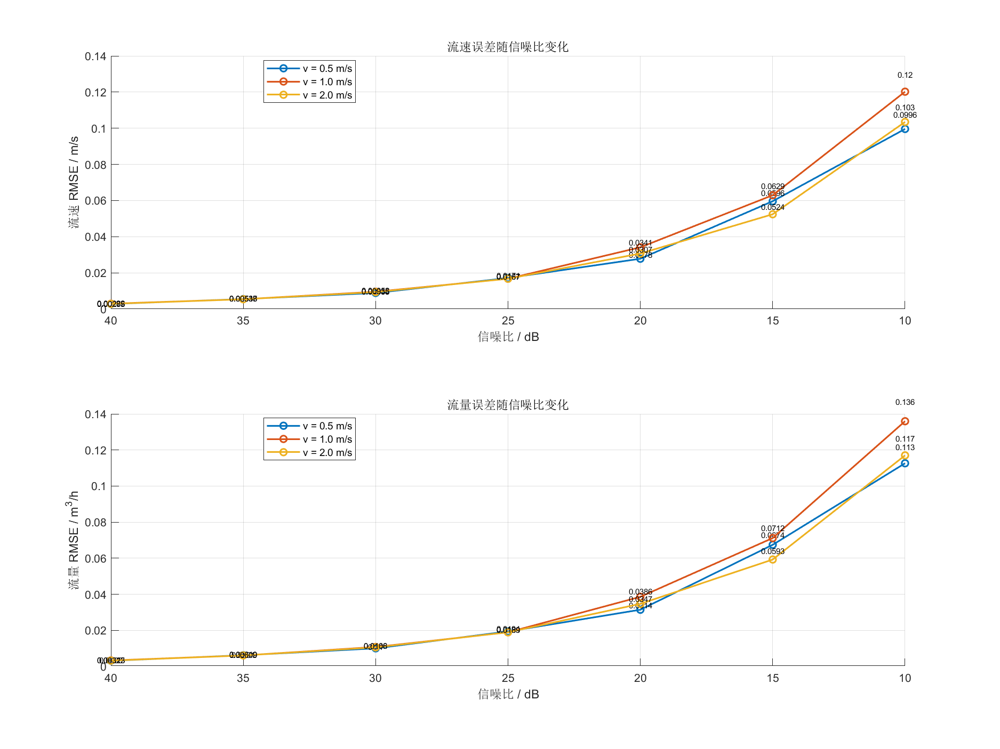

# 6.4 流量输出正确性验证

流量输出正确性验证围绕两部分展开：一是检验无噪声条件下由 `Δt` 到流速、流量的换算是否正确；二是分析噪声和时间差误差如何传递到最终输出层。由于流速与流量均由同一换算链路得到，二者在误差趋势上具有一致性，因此正文以流速误差为主进行分析，并辅以流量误差说明。

## 6.4.1 无噪声条件下的流速与流量换算

在无噪声实验中，先由目标流速反推理论时间差，再经由数据包解析与插值恢复 `Δt`，最后代入流量换算公式得到流速和体积流量。该过程主要检验后级换算公式、单位换算和截面积计算是否正确。

图6-6给出了无噪声条件下的流速和流量估计结果。估计曲线与真值高度一致，残差保持在很低水平，说明后级换算链路在理想条件下具有正确的数值实现。

图6-6 无噪声条件下的流速与流量换算结果  

表6-6列出了无噪声条件下的汇总指标。流速估计 `RMSE` 约为 `0.00241 m/s`，流量估计 `RMSE` 约为 `0.00272 m^3/h`，失效率与离群率均为零，说明后级换算链路在理想条件下具有较高数值正确性。

表6-6 无噪声条件下的流速与流量换算指标

| 输出量 | 偏差 | 标准差 | `RMSE` | `95%` 区间 | 离群率 |
| --- | ---: | ---: | ---: | ---: | ---: |
| 流速 / m/s | -0.00149 | 0.00205 | 0.00241 | `[-0.00513, 0]` | 0 |
| 流量 / m^3/h | -0.00168 | 0.00232 | 0.00272 | `[-0.00580, 0]` | 0 |

## 6.4.2 不同信噪比下的流速与流量误差

当噪声作用于前端相关特征后，时间差估计误差会进一步传递到流速与流量输出层。图6-7给出了不同信噪比下的流速与流量误差曲线。图中采用对数坐标显示高信噪比区间的小误差值，因此可以同时观察亚百分位误差和低信噪比下的大误差。

图6-7 不同信噪比下的流速与流量误差曲线  

以 `v = 1.0 m/s` 为例，代表性结果列于表6-7。`SNR` 从 `40 dB` 降至 `10 dB` 时，流速 `RMSE` 由 `0.00292 m/s` 增大到 `0.12021 m/s`，流量 `RMSE` 则由 `0.00330 m^3/h` 增大到 `0.13596 m^3/h`。同时，离群率由 `0` 增至 `0.08`，说明低信噪比下最终输出不仅误差幅值增大，而且更容易出现异常样本。

表6-7 `v = 1.0 m/s` 时不同信噪比下的输出误差

| SNR / dB | 流速偏差 / m/s | 流速标准差 / m/s | 流速 `RMSE / m/s` | 流速 `95%` 区间 / m/s | 离群率 | 流量 `RMSE / m^3/h` |
| ---: | ---: | ---: | ---: | ---: | ---: | ---: |
| 40 | 0.00000 | 0.00293 | 0.00292 | `[-0.00527, 0.00633]` | 0 | 0.00330 |
| 30 | 0.00042 | 0.00954 | 0.00952 | `[-0.01767, 0.01704]` | 0 | 0.01077 |
| 20 | 0.00330 | 0.03406 | 0.03413 | `[-0.05788, 0.06836]` | 0 | 0.03860 |
| 15 | 0.01081 | 0.06216 | 0.06294 | `[-0.08890, 0.15122]` | 0.01 | 0.07118 |
| 10 | 0.02613 | 0.11763 | 0.12021 | `[-0.12868, 0.34357]` | 0.08 | 0.13596 |

这一结果表明，时间差误差向流速和流量误差的传播具有显著放大效应，因此前端时间差解算精度是最终输出精度的关键决定因素。

## 6.4.3 时间差误差向流速误差的传播

为量化 `Δt` 误差对最终输出的影响，进一步计算默认 `DN20` 条件下的“时间差误差 - 流速误差”关系，代表性结果列于表6-8。

表6-8 `DN20` 条件下时间差误差对应的流速误差

| `Δt` 误差 / ns | 流速误差 / m/s |
| ---: | ---: |
| 0.1 | 0.00489 |
| 0.2 | 0.00978 |
| 0.5 | 0.02446 |
| 1.0 | 0.04892 |
| 2.0 | 0.09783 |
| 5.0 | 0.24459 |

表6-8表明，在 `DN20` 条件下，时间差误差一旦达到 `1 ns` 量级，对应的流速误差已接近 `0.05 m/s`；若误差达到 `5 ns`，则流速误差约为 `0.245 m/s`。这一数量级已足以对瞬时流量输出造成明显影响，因此前端插值细化和后级异常剔除均具有必要性。

综合上述结果可知，后级流速与流量换算本身在理想条件下具有较高准确性，而实际误差主要取决于前端时间差估计精度以及噪声传递过程。
