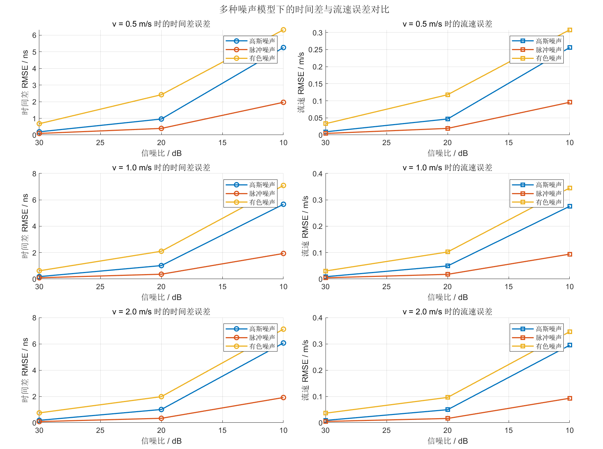
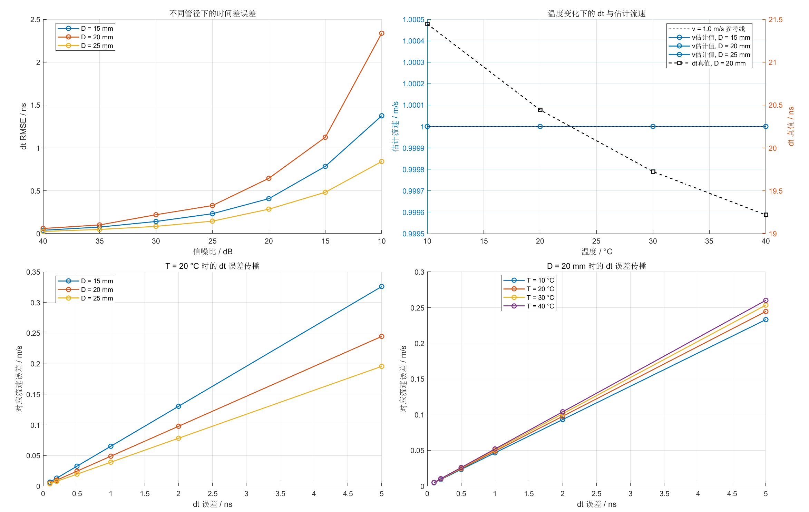
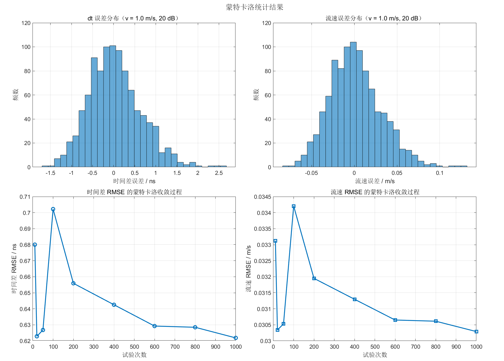
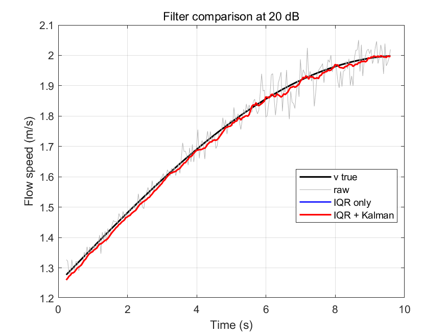
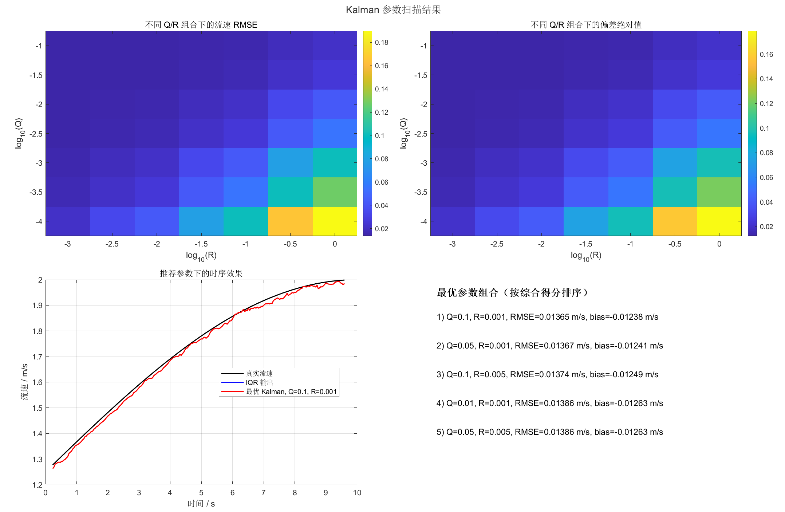
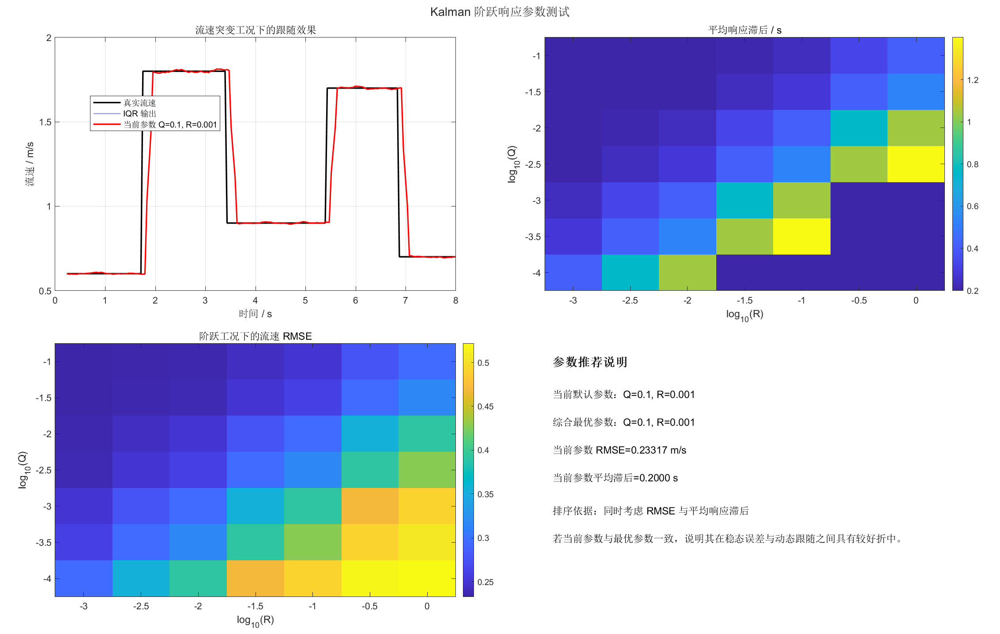

# 6.5 噪声与参数扰动下的鲁棒性分析

鲁棒性分析用于说明系统误差的主要来源以及不同算法环节对扰动的敏感程度。相关实验包括多种噪声模型对比、管径与温度敏感性分析、蒙特卡洛统计、后级异常剔除与滤波效果对比，以及 `Kalman` 参数扫描与阶跃响应测试。

## 6.5.1 多种噪声模型对比

仅采用高斯噪声可以支撑基础验证，但不足以覆盖工程环境中全部干扰形式。为此，进一步引入脉冲噪声与有色噪声，分别模拟偶发毛刺和具有时间相关性的背景扰动。图6-8给出了三种噪声模型下的误差曲线。

图6-8 不同噪声模型下的时间差与流速误差  

以 `v = 1.0 m/s, SNR = 20 dB` 为例，代表性结果如表6-9所示。

表6-9 `v = 1.0 m/s, SNR = 20 dB` 时不同噪声模型的误差对比

| 噪声模型 | 偏差 / ns | 标准差 / ns | `Δt RMSE / ns` | `95%` 区间 / ns | 流速 `RMSE / m/s` |
| --- | ---: | ---: | ---: | ---: | ---: |
| 高斯噪声 | -0.0370 | 1.0214 | 1.0178 | `[-1.8889, 2.1344]` | 0.04959 |
| 脉冲噪声 | 0.0060 | 0.3653 | 0.3639 | `[-0.7899, 0.6914]` | 0.01772 |
| 有色噪声 | 0.0128 | 2.1150 | 2.1062 | `[-3.9497, 3.9176]` | 0.10249 |

表6-9显示，有色噪声对应的标准差和 `RMSE` 均最大，且 `95%` 区间显著宽于另外两类噪声，说明具有时间相关性的扰动更容易扭曲局部相关峰形状。脉冲噪声在当前脉冲概率与幅值参数设置下的统计误差低于高斯噪声，这表明噪声影响不仅与幅值有关，也与作用频度和局部窗口长度有关。因此，高斯噪声适合作为基础验证模型，而脉冲噪声和有色噪声更适合作为扩展鲁棒性分析。

## 6.5.2 管径、温度与误差传播敏感性

不同管径和不同介质温度会影响传播时间量级与误差传播关系。图6-9给出了多变量敏感性分析结果，其中包含不同管径下的信噪比扫描、不同温度下的理论传播时间变化以及时间差误差向流速误差的映射关系。

图6-9 管径、温度与误差传播敏感性分析  

表6-10列出了 `20 dB` 条件下不同管径的代表性误差。

表6-10 `20 dB` 条件下不同管径的误差对比

| 管径 / mm | 偏差 / ns | 标准差 / ns | `Δt RMSE / ns` | `95%` 区间 / ns | 流速 `RMSE / m/s` |
| ---: | ---: | ---: | ---: | ---: | ---: |
| 15 | 0.0256 | 0.4081 | 0.4075 | `[-0.8232, 0.7119]` | 0.01488 |
| 20 | 0.0746 | 0.6430 | 0.6451 | `[-1.0138, 1.3883]` | 0.03143 |
| 25 | -0.0432 | 0.2828 | 0.2851 | `[-0.5562, 0.5269]` | 0.01736 |

在当前参数范围内，`20 mm` 条件下的 `Δt RMSE` 和流速 `RMSE` 均高于另外两组管径，因此将 `DN20` 作为重点分析对象具有代表性。另一方面，温度主要改变绝对传播时间和声速，但在当前模型下并未显著破坏流速恢复结果。相关代表性数据列于表6-11。

表6-11 `DN20` 条件下温度变化对传播时间的影响

| 温度 / ℃ | 声速 / m/s | 理论 `Δt / ns` | 估计流速 / m/s |
| ---: | ---: | ---: | ---: |
| 10 | 1447.28 | 21.4457 | 1.0000 |
| 20 | 1482.36 | 20.4427 | 1.0000 |
| 30 | 1509.14 | 19.7235 | 1.0000 |
| 40 | 1528.88 | 19.2176 | 1.0000 |

表6-11表明，温度变化确实会改变声速与理论时间差，但在当前传播时间模型下，对最终流速恢复的影响较小。因此，在当前模型与参数范围内，误差主导项仍为噪声与时间差估计误差，而非温度补偿不足。

## 6.5.3 蒙特卡洛统计结果

为了避免误差曲线由单次随机样本决定，进一步在固定工况 `v = 1.0 m/s, SNR = 20 dB` 下进行了 `1000` 次重复试验。图6-10给出了误差分布直方图和 `RMSE` 收敛曲线。

图6-10 蒙特卡洛统计结果  

代表性统计指标列于表6-12。

表6-12 `v = 1.0 m/s, SNR = 20 dB` 条件下的蒙特卡洛统计结果

| 指标 | 数值 |
| --- | ---: |
| 试验次数 | 1000 |
| `Δt` 偏差 / ns | 0.0317 |
| `Δt` 标准差 / ns | 0.6213 |
| `Δt RMSE / ns` | 0.6218 |
| `Δt` 95% 区间 / ns | `[-1.0563, 1.3625]` |
| `Δt` 离群率 | 0 |
| 流速偏差 / m/s | 0.00155 |
| 流速标准差 / m/s | 0.03027 |
| 流速 `RMSE / m/s` | 0.03029 |
| 流速误差 95% 区间 / m/s | `[-0.05145, 0.06637]` |
| 流速离群率 | 0 |

收敛曲线表明，当试验次数增至 `400` 次以上后，`RMSE` 指标已进入相对稳定区间；达到 `1000` 次时，统计结果趋于收敛。表6-12中偏差远小于标准差，说明该工况下误差主要表现为随机波动，而非显著系统性偏移。因此，当前第六章中采用的多次重复试验并非单次偶然结果，而是具有一定统计稳定性的平均表现。

## 6.5.4 后级异常剔除与平滑处理效果

时间差误差进一步传递到流速输出后，会表现为短时抖动和离群值。为减小此类波动，首先采用基于 `IQR` 的窗口异常剔除，再比较是否引入一维 `Kalman` 滤波。图6-11给出了三种输出序列的时域对比结果。

图6-11 后级异常剔除与平滑处理效果  

表6-13列出了三种处理方式的指标。

表6-13 不同后级处理方式下的流速误差指标

| 方法 | 偏差 / m/s | 标准差 / m/s | `RMSE / m/s` | `95%` 区间 / m/s | 离群率 |
| --- | ---: | ---: | ---: | ---: | ---: |
| 原始输出 | -0.00199 | 0.03198 | 0.03198 | `[-0.07266, 0.06232]` | 0 |
| 仅 IQR | -0.00974 | 0.00674 | 0.01184 | `[-0.02045, 0.00535]` | 0 |
| IQR + Kalman | -0.00977 | 0.00674 | 0.01186 | `[-0.02049, 0.00523]` | 0 |

可以看到，`IQR` 处理将 `RMSE` 从 `0.03198 m/s` 降低到 `0.01184 m/s`，降幅约为 `63.0%`；同时，`95%` 区间由 `[-0.07266, 0.06232] m/s` 收窄至 `[-0.02045, 0.00535] m/s`，说明输出波动范围得到压缩。加入参数整定后的 `Kalman` 滤波后，`RMSE` 为 `0.01186 m/s`，与 `IQR` 单独处理结果非常接近。该结果说明，`IQR` 是抑制离群扰动的有效步骤，而 `Kalman` 作为后级平滑环节，在当前配置下未引入明显误差恶化，但额外精度收益也较为有限。

## 6.5.5 Kalman 参数扫描与阶跃响应测试

由于 `Kalman` 滤波结果对参数敏感，进一步对多个 `Q/R` 组合进行了网格扫描。图6-12给出了不同参数组合下的 `RMSE` 和偏差热力图，并展示了推荐参数下的时序结果。

图6-12 Kalman 参数扫描结果  

参数扫描结果表明，在当前实验条件下，`Q = 0.1, R = 0.001` 的 `RMSE` 最小且偏差处于可接受范围内，可视为稳态误差意义下更合适的一组参数。

仅依据稳态误差仍不足以说明动态性能，因此进一步构造流速突增、突降的阶跃工况，比较不同参数下的输出跟随能力。图6-13给出了阶跃响应测试结果。

图6-13 Kalman 阶跃响应测试结果  

表6-14列出了推荐参数在动态响应测试中的表现。

表6-14 推荐 Kalman 参数及其动态响应指标

| 参数或指标 | 数值 |
| --- | ---: |
| `Q` | 0.1 |
| `R` | 0.001 |
| `p0` | 15.0 |
| 稳态扫描偏差 / m/s | -0.01238 |
| 稳态扫描标准差 / m/s | 0.00576 |
| 稳态扫描 `RMSE / m/s` | 0.01365 |
| 稳态扫描 `95%` 区间 / m/s | `[-0.02271, -0.00015]` |
| 阶跃工况流速 `RMSE / m/s` | 0.2332 |
| 阶跃工况离群率 | 0.1026 |
| 平均响应滞后 / s | 0.20 |
| 最大响应滞后 / s | 0.20 |
| 有效跟随阶跃次数 | 4 |

图6-12与图6-13的联合结果说明，当前推荐参数在“误差较小”和“跟随较快”两个维度上具有较好折中。阶跃工况下的 `RMSE` 明显高于稳态扫描结果，主要由真实流速突变与滤波输出滞后共同造成，并不等同于静态测量精度下降。因此，若系统后级保留 `Kalman` 作为平滑环节，`Q = 0.1, R = 0.001, p0 = 15.0` 可作为当前阶段的推荐配置。
