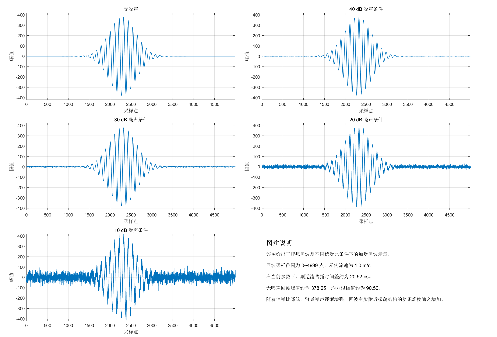

# 6.2 MATLAB 仿真平台构建

MATLAB 仿真平台采用统一配置文件管理实验参数，并以“特征级仿真”和“原始波形级仿真”两条路径构建验证链路。前者直接生成与硬件系统一致的特征包，用于检验 MCU 端数值解算过程；后者从两路回波波形出发，通过局部互相关与峰值搜索提取 `idxA`、`idxB` 及三点相关值，再完成数据包构造，从而模拟 FPGA 与 MCU 联合工作的数据流。

图6-1给出了回波示意模型在不同信噪比条件下的波形形态。理想回波采用高斯包络调制正弦波构造，采样点总数设为 `5000`，主回波中心位置位于第 `2300` 个采样点附近。随信噪比从 `40 dB` 下降至 `10 dB`，主回波峰值附近的扰动逐渐增强，但主回波整体包络仍保持可辨识形态。该组图用于说明输入波形模型与噪声注入方式具有统一且可重复的构造基础。

图6-1 不同信噪比下的回波波形示意  

主要实验参数如表6-1所示。参数设置围绕 `DN20` 小口径液体管道展开，采样周期与前级设计保持一致，后级滤波参数则采用当前扫描后得到的推荐组合。

表6-1 MATLAB 仿真平台主要参数设置

| 参数项 | 取值 | 说明 |
| --- | --- | --- |
| 管道内径 | `20 mm` | 默认基准管径 |
| 管壁厚度 | `1 mm` | 用于管壁传播时间修正 |
| 采样频率 | `65 MHz` | 与 FPGA 端采样周期保持一致 |
| 采样周期 | `15.38 ns` | `Ts = 1/65 MHz` |
| 角度参数 | `cos θ = 0.913545`，`sin θ = 0.406738` | 用于流速换算 |
| 固定延迟 `te` | `12000 ns` | 前级激励与固定时延项 |
| 管材 | `PVC` | 用于管壁传播时间估计 |
| SNR 扫描点 | `40, 35, 30, 25, 20, 15, 10 dB` | 鲁棒性实验通用设置 |
| 代表性流速点 | `0.5, 1.0, 2.0 m/s` | 噪声与鲁棒性实验通用设置 |
| IQR 窗长/步长 | `30 / 5` | 后级异常剔除参数 |
| Kalman 推荐参数 | `Q = 0.1, R = 0.001, p0 = 15.0` | 参数扫描后采用的配置 |
| 蒙特卡洛重复次数 | `1000` | 单独统计实验配置 |

统一配置的意义在于保证不同实验之间具有可比性。例如，时间差误差曲线、流量误差曲线、插值对比和滤波参数扫描均基于同一组管道与采样参数展开，因此不同图表之间可以直接形成对应分析关系，而无须额外引入参数换算偏差。
